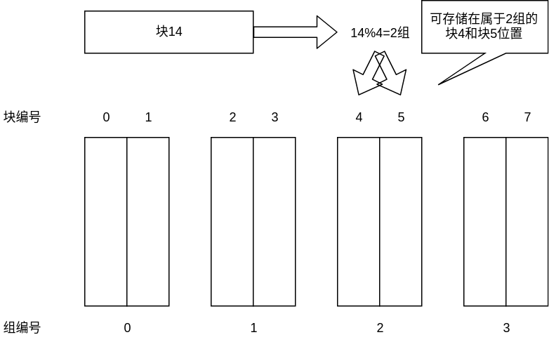
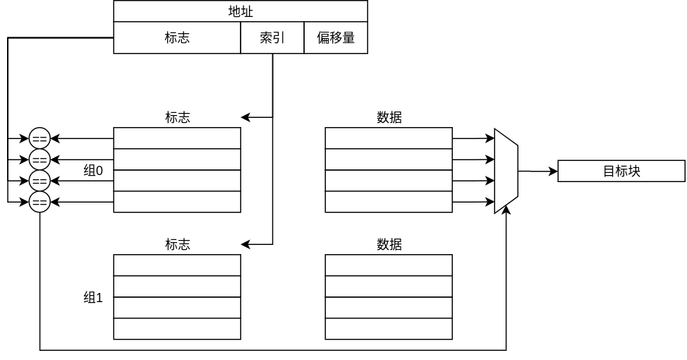
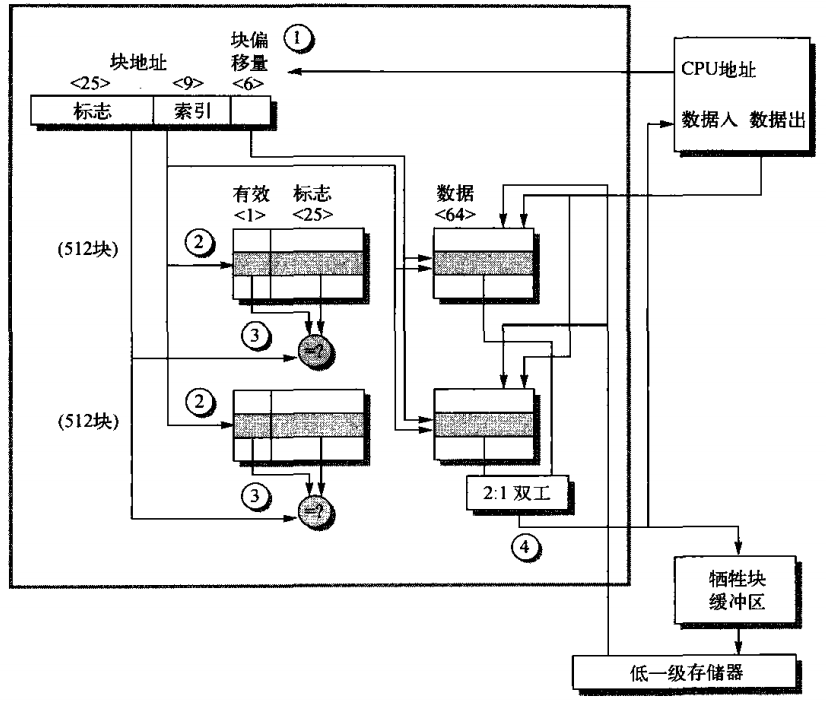
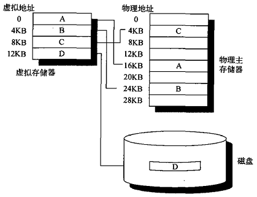

# 存储器性能评价指标

## 存储器停顿周期数

存储器的性能直接影响到CPU的性能评价，定义存储器停顿周期数为CPU等待存储器访问而停顿的时钟周期数，由此有CPU执行时间有：
$$
CPU执行时间=(CPU时钟周期数+存储器停顿时钟周期数) \times 时钟周期时间
$$
因此需要存储器停顿时钟周期数越小越好，对于这一变量有公式如下：
$$
存储器停顿周期数 = 缺失数量 \times 缺失代价 = 指令数 \times \frac{产生缺失指令数量}{指令数} \times 缺失代价 \\ = 指令数 \times \frac{存储器访问指令数}{指令总数} \times 缺失率 \times 缺失代价
$$
其中，缺失率表示存储器访问指令中会产生cache缺失的百分比；缺失代价表示发生cache缺失后为了解决缺失需要消耗的平均时钟周期数。另一种度量指标与时钟周期无关，即为每条指令的平均缺失数：
$$
平均缺失数=\frac{产生访存缺失的指令数}{指令总数} = 缺失率 \times \frac{存储器访问指令数}{指令总数}
$$
上述公式与缺失代价无关，缺失率的定义与上文相同

## 存储器平均访问时间

缓存性能比较好的度量为存储器平均访问时间，即对于每次存储器访问而言需要的平均时间，公式如下：
$$
存储器平均访问时间 = 命中时间 + 缺失时间 \times 缺失代价
$$
需要注意的是这一指标仅针对存储器访问指令，因此这是一个间接度量，考虑以下情况：

| 参数                               | 数据  |
| ---------------------------------- | ----- |
| 16KB指令缓存缺失数（每千条指令）   | 3.82  |
| 16KB数据缓存缺失数（每千条指令）   | 40.9  |
| 32KB统一缓存缺失数（每千条指令）   | 43.3  |
| 统一缓存数据访问额外需要时钟周期数 | 1     |
| 存储器访问中指令引用占比           | 74%   |
| 命中周期数/缺失代价                | 1/100 |
| 指令中数据传输指令占比             | 36%   |

需要复习的是，缺失数指的是对于所有指令而言产生存储器缺失的次数，而缺失率为相对于所有存储器访问产生缺失的比例。对于16KB的指令缓存，每条指令都会产生一次指令访问，缺失率为：
$$
缺失率_{指令} = \frac{3.82}{1000 \times 1} = 0.004
$$
对于16KB的数据缓存，有36%的指令会产生一次存储器访问，因此有：
$$
缺失率_{数据} = \frac{40.9 }{0.36 \times 1000} = 0.114
$$
有74%的存储器访问为指令访问，因此总体的缺失率为：
$$
缺失率_{分裂} = 0.74 \times 0.004 + 0.26 \times 0.114 = 0.0326
$$
考虑存储器平均访问时间，有：
$$
存储器平均访问时间_{分裂} = 0.74 \times (1+0.004 \times 200) + 0.26 \times (1 + 0.114\times 200) = 7.52
$$
对于32KB统一缓存而言，1000条指令一共产生1000次指令访存，其中36%的指令会产生数据访存，如下所示：
$$
缺失率_{统一} = \frac{43.3}{1000 + 1000 \times 0.36} = 0.0318
$$
对于统一缓存而言，数据访存指令会产生两种存储器访问，一次指令访问和一次数据访问，而统一缓存仅有端口，因此数据访问需要等待一个时钟周期，因此存储器平均访问时间：
$$
存储器平均访问时间_{统一} = 0.74 \times (1+0.0318 \times 200) + 0.26 \times (1 + 1 + 0.0318 \times 200) = 7.62
$$

## 对CPU性能影响

对于CPU性能而言，有以下公式：
$$
CPU执行时间=(CPU时钟周期数+存储器停顿时钟周期数) \times 时钟周期时间
$$
一般认为缓存命中时间作为CPU执行时钟周期数的一个部分，考虑一个以下参数的缓存：

| 参数                       | 数值 |
| -------------------------- | ---- |
| CPU执行周期数              | 1    |
| 缺失代价                   | 200  |
| 平均缺失率                 | 2%   |
| 每条指令的存储器引用数     | 1.5  |
| 平均缓存缺失数（千条指令） | 30   |

对于以上参数，每千条指令产生的存储访问数为$1000 \times 1.5 = 150$，存储器访问的缺失率为2%，即千条指令产生的存储器缺失数量为$150 \times 2\%=30$，与给出的平均缓存缺失数一致。使用缺失数计算CPU执行时间：
$$
CPU执行时间 = IC \times (1 + \frac{存储器停顿周期数}{IC}) \times 时钟周期 \\= IC \times (1 + \frac{停顿数}{IC} \times 缺失代价) \times 时钟周期 = IC \times (1+\frac{30}{1000} \times 200) \times 时钟周期 \\ = 7 \times IC \times 时钟周期
$$
上述分析均对于顺序存储器而言，其每次存储器缺失都会暴露为缺失代价。对于乱序处理器而言，其存储器缺失可能被乱序执行的其他指令掩盖，即有：
$$
存储器停顿周期 = 缺失数 \times (总缺失代价 - 重叠缺失延迟)
$$
对于乱序执行的CPU而言，分析比较复杂，若一个时钟周期该CPU没有提交最大可能数目的指令，则认为该CPU发生的了存储器访问缺失。

# 存储器层次结构

存储器之间的关于存储器层次结构，需要解决以下四个问题：

- 块的放置：一个块可以放在这一级的什么位置
- 块的识别：如何找到放置在这一级中的一个块
- 块的替换：在缺失时应当替换哪个块
- 块的写入：写入时发生什么

## 块的放置

首先定义**组**的概念，一个组是存储器中的一段连续空间，可以容纳多个（整数个）块。取一个存储器中组的数量为m，每个组可以容纳的块的数量为n，有以下关系：
$$
存储器容量 = m \times n \times 块大小
$$
任何来自某个地址的块只能被放置在一个特定的组中，这种方法被称为组相联，一个组中可以容纳n个块，即为n-路组相联。块首先被映射到组，组编号为：
$$
组编号 = 块地址 \% m 
$$
随后，这个块可以被放置在这个组中的任意块地址位置。即对于一个块地址为A的块而言，对应的组编号为$G = A\%m$，其可以被放置在这个编号为G的组中的任意有效的块起始地址位置。如下图所示：

对于组相联，有两种特殊情况：

- 直接映射：每个块只能存储在一个固定的位置，有$存储地址=块地址 \% m$，可认为时n=1的1-组相联
- 全相联：一个块可以放置在任意位置，可认为时m=1的n-路组相联（缓存中仅有一个组）

## 块的识别

块的识别通过标签识别实现，每个存储器中的块对应一个标签，标签中包括一部分地址信息和有效性信号。对于一个块中的一个数据而言，其地址分为以下几个部分：

- 标志部分：地址的高位部分，判断块时需要比对的部分
- 索引部分：地址的中间部分，标记这个块若存在于存储器中，应当存在于哪个组中，这个部分不用于判断
- 块偏移：地址的低位部分，标记这个数据相对于块起始地址的偏移量

识别块时，首先根据索引部分查找到对应的组，再对比组内所有块的标志部分和要查找的块的标签部分是否相同，同时判断有效性。若标志部分相同且有效，则这个块为待识别的块，否则无识别的块，过程如下所示：

首先提供查找地址，根据其中的索引查找到可能保存这个块的组，随后比对组内的所有标志和有效位，当有有效位置高且标志匹配的块，则命中，查找到该块。对于要查找的数据，根据偏移量从块中获取数据。

## 块的替换

当块发生缺失且对应的组中没有空闲的位置时，需要从已有的块中选择一个丢弃，块的替换算法决定丢弃哪个块，替换算法有以下几种：

- 随机：随机选择一个块丢弃
- 最近最少使用（LRU）：丢弃掉未使用时间最久的块
- 先入先出（FIFO）：丢弃掉进入存储器最久的块

最近最少使用算法的记录比较困难，常见的替换方法为伪LRU算法，为每一个块设置一个bit。每次对一个块的访问会使这个bit置位为1，当一次访问后所有的bit均为高时，所有bit拉低，仅当前访问的块对应的bit拉高。当需要替换块时，随机从该bit为低的块中选择一个替换

## 块的写入

 块的写入和读取最大的差别在于读取操作可以“任意进行”，因为对任何空间的读取不会对该该空间中的数据产生影响，而写入操作必须“精准执行”，因为写入操作对存储空间中的数据产生影响。对于这一级存储器中任何一个块的写入会产生一致性问题，即当前级的数据与上一级的数据不同，为了解决这一问题，有两种解决方法：

- 直写：写入这一级存储的同时写入上一级存储
- 写回：仅写入这一级存储，当被写入的块被替换时写回上一级存储器

直写策略容易实现，能保证数据的一致性，这上一级存储器中的数据永远时清洁的（即一致的），缺点是时间消耗大。而写回策略延迟低，但是实现复杂。当写回上一级存储器时，往往先将块放入写入缓冲器以减小延迟。另外，当需要对一个地址进行写入时，可能这个地址对应的块不在这一级存储器中，有两种策略：

- 写入分派：首先执行命中操作，将块调入缓存，再进行写入
- 无写入分派：不将对应块调入，直接写入上一级存储器，直写策略下常常使用

## 举例：Opteron缓存

AMD的Opteron处理器缓存组织方式如下图所示

 

进入缓存的地址位宽为40bit，该缓存的容量为64KB，块大小为64B，使用两路组相联缓存。即由上可知，组内偏移量为6bit，缓存内共$\frac{64KB}{64}=1024$个块，使用两路组相联即有$\frac{1024}{2} = 512$个组，由此组索引位宽为9bit，地址位宽40bit，因此标志位宽为$48-9-6=25$bit。

该缓存使用最少替代（LRU）策略和写回/写入分派策略，对于一次缓存访问过程，过程如下：

1. CPU给出40bit物理地址，分为标记、索引和偏移量三个部分（对应图中标号1）
2. 根据索引部分找到可能存放这个块的组，读取组中两个块中的标记部分（对应图中标号2）
3. 将两个标记与地址的标志部分比较，同时检查有效位是否为拉高：若有一个标记有效且与地址的标记相同，则缓存命中，使用二选一选择器将对应的数据数据输出；否则缓存未命中，需要进行访问低级存储器获取这个块（对应图中标志3）
4. 若缓存未命中，则根据最少替代策略选择一个块，并将这个块送入牺牲块缓冲区，再由牺牲块缓冲区写回低级存储器，同时从低级存储器调入需要访问的块（对应图中标志4）

由于这一缓存使用LRU和写回策略，因此对于每一个块，除了有效位以外，还需要设置LRU位和脏位设置标记，脏位用于表示该块是否与低级存储器中的块相同。当每次访问（无论读写）这个块时，都需要根据LRU算法对LRU位进行设置；当写一个块时，就将脏位拉高，因为只要块被写入，就认为其与低级缓存不同。

# 缓存优化初级

## 缺失模型

对于缓存优化，首先根据缺失类型将其分为3类：

- 强制缺失：第一次访问一个块时，这个块一定不在内存中，产生缺失成为强制缺失
- 容量缺失：缓存无法容纳所有的块，当缓存容量满后，再载入块时必然放弃原有的块，再次访问由于容量不足被放弃的块产生的缺失为容量缺失
- 冲突缺失：对于组相联结构，每个组中的块有限，当一个组满且另一个属于这个组的块被调入时，组中的某个块必然被放弃，再次访问由于块内冲突被放弃的块产生的缺失为冲突缺失

## 优化原理

优化目标为缩短存储器平均访问时间，有公式：
$$
存储器平均访问时间 = 命中时间+缺失率\times 缺失代价
$$
因此缩短存储器平均访问时间，有以下几种优化方法：

- 缩短命中时间：索引时避免地址转换、提前读取
- 降低缺失率：使用较大的块、较大的缓存和较高的关联度
- 降低缺失代价：多级缓存、使读取操作设定高于写入操作

## 基础优化方法

下图是优化方法及其影响的汇总表

| 名称               | 命中时间 | 缺失代价 | 缺失率 | 硬件复杂度 | 备注             |
| ------------------ | -------- | -------- | ------ | ---------- | ---------------- |
| 增大块大小         | 无影响   | 增大     | 降低   | 无影响     | 需要合理设计大小 |
| 较大缓存大小       | 延长     | 无影响   | 降低   | 增加       | 广泛应用         |
| 提高组相联度       | 延长     | 无影响   | 降低   | 增加       | 广泛应用         |
| 多级缓存           | 无影响   | 降低     | 无影响 | 大幅度增加 | 广泛应用         |
| 提高读取缺失优先级 | 无影响   | 降低     | 无影响 | 增加       | 广泛应用         |
| 使用虚拟地址       | 降低     | 无影响   | 无影响 | 增加       | 广泛应用         |

### 增加块大小

由于空间局域性原理（一个被用到的数据附近的数据可能被用到），增大块大小可以减少强制缺失，由此降低缺失率。但是较大的块会增加缺失代价，即一个块的尺寸变大，产生访问缺失时，需要花费更多的时钟周期从低级存储器中获取这个较大的块。因此选取块的大小需要综合考虑这两个因素。对于一个16K存储器，缺失率、缺失代价与块大小有以下表所示的关系：

| 块大小 | 缺失率 | 缺失代价                            |
| ------ | ------ | ----------------------------------- |
| 32     | 1.35%  | $80+32 \times \frac{2}{16} = 84$    |
| 64     | 1.06%  | $80 + 64 \times \frac{2}{16} = 88$  |
| 128    | 1.02%  | $80 + 128 \times \frac{2}{16} = 96$ |

缺失代价为无论块大小，都首先消耗80个时钟周期，随后每2个时钟周期载入16个数据。由存储器平均访问时间的公式，假设命中时间为1个时钟周期，有：
$$
存储器平均访问时间_{32} = 1 + 0.0135 \times 84 = 2.134 \\
存储器平均访问时间_{64} = 1 + 0.0106 \times 88 = 1.933 \\
存储器平均访问时间_{128} = 1+0.0102 \times 96 = 1.979
$$
由上，尺寸为64的块最适合该系统。选取块的大小需要考虑低级存储器的带宽，这一参数决定缺失代价相对于块大小的上升速度。对于高带宽的系统而言，可以选择较大的块，因为此时缺失代价的上升速度低于缺失率的下降速度。

### 增大缓存大小

增大缓存大小可以减小容量缺失进而降低缺失率，但对应的可能增加命中时间和硬件复杂度

### 提高组相联度

提高组相联度可以降低冲突缺失进而降低缺失率，对于组相联度有以下两条经验公式：

- 对于降低冲突缺失率而言，八路组相联的效果基本等同于全相联
- 2:1经验规律：大小为N的直接映射缓存与大小为N/2的2路组相联缓存大致具有相同的缺失率

对应的，提高组相联度会使硬件的命中部分变得复杂，提高了命中时间。

### 使用多级缓存

多级缓存降低了缺失代价，二级缓存（L2）指再一级缓存（L1）和主存储器之间的缓存。当一级缓存发生缺失时，访问二级缓存查找数据；若二级缓存缺失，则由二级缓存到主存中找到数据。使用二级缓存后有：
$$
缺失代价_{L1} = 存储器平局访问时间_{L2} = 命中时间_{L2} + 缺失率_{L2} \times 缺失代价_{L2}
$$
代入一级缓存的存储器平均访问时间公式有：
$$
存储器平局访问时间_{L1} = 命中时间_{L1} + 缺失率_{L1} \times (命中时间_{L2} + 缺失率_{L2} \times 缺失代价_{L2})
$$
由于使用了二级缓存，对缺失率的定义细化如下：

- 局部缺失率：$\frac{缓存中的产生的缺失数}{对该缓存进行存储器访问的总数}$，即对于L1缓存为$缺失率_{L1}$，对L2缓存为$缺失率_{L2}$
- 全局缺失率：$\frac{该缓存中产生的缺失数}{处理访问缓存总数}$，对于L1缓存为$缺失率_{L1}$，对L2缓存为$缺失率_{L1} \times 缺失率_{L2}$

对于二级缓存，停顿周期参数如下所示：
$$
每条指令平均存储器停顿周期 = 缺失数_{L1} \times 缺失代价_{L1} + 缺失数_{L2} \times 缺失代价_{L2}
$$
即对于一条指令而言，若产生缺失，则要么这一数据在L2缓存中，要么这一数据在L2缓存也缺失。对于第一种情况，这一指令的缺失仅计入$缺失数_{L1}$中；对于第二种情况，这一指令的缺失同时计入$缺失数_{L1}$和$缺失数_{L2}$。现在考虑一个以下参数的缓存系统：

| 参数                       | 数据 |
| -------------------------- | ---- |
| 第一级缓存缺失（千次引用） | 40   |
| 第二级缓存缺失（千次引用） | 20   |
| 每条指令存储引用数         | 1.5  |
| L1命中时间                 | 1    |
| L2命中时间                 | 10   |
| L2缺失代价                 | 200  |

有缺失率如下所示：
$$
全局缺失率_{L1} = 局部缺失率_{L1} = \frac{40}{1000} = 4\% \\
局部缺失率_{L2} = \frac{20}{40} = 50\% \\
全局缺失率_{L2} = \frac{20}{1000} = 2\%
$$
由此计算存储器平均访问时间：
$$
存储器平局访问时间 = 1 + 0.04 \times (10 + 0.5 \times 200) = 5.4个时钟周期
$$
若要计算每条指令的平均停顿时间，首先要计算缺失数：
$$
缺失数_{L1} = \frac{40}{\frac{1000}{1.5}} = 0.06 \\
缺失数_{L2} = \frac{20}{\frac{1000}{1.5}} = 0.03
$$

随后根据缺失代价和缺失数计算每条指令的平均停顿时间：
$$
每条指令平均停顿时间 = 缺失数_{L1} \times 缺失代价_{L1} + 缺失数_{L2} \times 缺失代价_{L2} \\
= 0.06 \times 10 + 0.03 \times 200 = 6.6
$$
对于两个指标，有如下关系：
$$
(存储器平均访问时间 - 命中时间) \times 每条指令存储访问数量 = (5.4- 1)\times 1.5 = 6.6 = 每条指令平均停顿时间
$$
对于二级缓存的设计，有两个需要注意的点：

- 第二级缓存如果足够大（远大于一级缓存），则二级缓存的局部缺失率与全局缺失率非常相似
- 二级缓存的主要评价指标是缓存全局缺失率

对于二级缓存而言，首先需要考虑的是容量问题，一般来说二级缓存的容量应当略大于一级缓存；随后二级缓存使用组相联可以有效提高缺失代价；最后需要根据实际情况选择多级包含和多级互斥的策略：

- 多级包含：二级缓存需要包含一级缓存中包含的所有块，实现简单，但是需要在多级之间使用相同的块大小，可能降低缓存的性能
- 多级互斥：一级缓存中的块一定不会出现在二级缓存中，一级缓存从二级缓存中调入块的过程复杂化为一二级缓存块的交换，优点是仅需要二级缓存略大于一级缓存

### 提高读取缺失优先级

考虑缓存向存储器写入的情况，一般使用一个写缓冲区，当进行写入时，首先将数据写入写缓冲区中，此时认为写入完成，之后再由写缓冲区将数据写回主存。此时会有一个问题，即写缓冲块中可能有某次读请求需要的数据的最新副本（已经执行写入指令但尚未写入到主存中），具有两种解决方法：

- 等待：每次读请求都等待写缓冲区清空再读取，实现简单，效率很低
- 访问：每次读请求首先从写缓冲区查找数据，再执行缓存命中，为目前的通用方法

为了降低产生缺失的缺失代价，可以设置读取优先级高于写入优先级。若读取优先级未高于写入优先级，若当写缓冲区正在写入主存时产生读取缺失，首先需要等待写入完成再进行块读取，即：
$$
缺失代价 = 写入时间 + 块读取时间
$$
若读缺失优先级高于写入缺失，无论写缓冲区是否执行写入，读缺失都会立刻处理（若有写操作则打断），缺失代价即直接为块读取时间。

### 使用虚拟地址

虚拟地址为操作系统分配个每个进程的存储空间的地址。对于使用物理地址的缓存，则首先需要将CPU给出的虚拟地址转换为物理地址，然后使用物理地址对缓存进行命中。这样操作的缓存设计简单，但命中过程中涉及虚拟和物理地址的转换，因此延长了命中时间，即：
$$
虚拟地址命中时间 = 地址转换时间 + 物理地址命中时间
$$
为了降低命中时间，可以使用基于虚拟地址的缓存，即缓存中使用虚拟地址。但使用虚拟地址会产生一系列问题：

- 保护问题：虚拟地址转为物理地址时需要检查页级保护，解决方法为在缺失时从主存中复制保护信息保存到缓存中，每次访问都进行检查
- 切换进程：每个进程都有自己的虚拟地址空间，可能出现两个进程的相同虚拟地址对应不同的物理地址，因此每次切换进程是需要刷新缓存，产生大量的强制缺失。解决方法是在标签中添加PID（进程识别标识符）字段，标记这个缓存的块属于哪一个进程，命中时进行检查。
- 别名地址：对于一个进程，可能给一个物理地址赋予多个不同的虚拟地址，因此可能出现一个物理块在缓存中有多个副本，若对一个副本进行写入，则会出现多个块不一致的问题。解决方法是别名消去，即要求每个缓存块必须拥有一个独一无二的物理地址。其中一种方案是检查所有块，例如一个两路组相联的64KB缓存（地址位宽16bit），块尺寸为4KB（偏移量地址12bit），标签位宽为3bit（16-12-1），则当发生缺失时，检查所有可能的块地址共八个，若有匹配，则使其无效。
- I/O交换：I/O一般使用物理地址，映射到虚拟地址涉及地址转换

一种折中的方案是仍然使用物理地址，但是当命中开始时直接使用块内偏移地址进行数据访问，同时并行的执行虚拟地址向物理地址的转换（虚拟地址和物理地址的块内偏移量相同），匹配使用物理地址匹配；即使用数据访问和地址转换并行掩盖地址转换时间。

# 虚拟存储器

虚拟存储器方案将物理存储器划分为块，分配给不同的进程，每个进程仅能访问属于自己的块，虚拟存储器用于自动的处理主存储器（内存）和辅助存储器（硬盘）两级存储结构。虚拟存储器提供虚拟地址，一个进程执行需要连续的虚拟地址空间，但这个连续的虚拟地址空间对应的物理地址可能是非连续的，甚至部分可能不在主存上，虚拟存储器用于自动的处理这些问题。虚拟地址和物理地址的对应关系如下所示：

虚拟存储器系统可根据划分方法分为三类：

- 页式：使用大小固定的块
- 段式：使用大小不固定的块
- 段页式：一个段由多个大小固定的页组成，一个段包括的页数不固定（一定是整数）

页和段的优缺点如下表所示：

| 指标     | 页                   | 段                                       |
| -------- | -------------------- | ---------------------------------------- |
| 信息长度 | 1（地址）            | 2（地址、长度）                          |
| 可见性   | 不可见               | 可见                                     |
| 替换块   | 容易                 | 复杂（需要查找一个可容纳该段的空余地址） |
| 磁盘通信 | 高效（每次长度相同） | 不一定（小的段可能仅几个字节）           |

## 层次结构

对于虚拟存储器，也需要考虑类似缓存的四个问题：放置、识别、替换和写入。需要注意的是，由于虚拟存储器管理的低级存储器为硬盘（磁盘或SSD），单位为页，因此缺失代价很大。所以在考虑上述问题时，优先考虑降低缺失率以提高性能：

- 放置：为了降低缺失率，一般使用全相联的方式，即一个页或段可以放置在主存的任意位置
- 识别：识别用页表或段表实现，即在主存中划分一部分区域，用于存储虚拟地址页号-物理起始地址的表。需要查找一个块时，需要访问两次主存：第一次访问页表获得其物理地址，第二次根据物理地址访问数据
- 替换：为了将缺失率降低，因此采用替换最近最少使用块（LRU）的方式
- 写入：考虑写入一个块需要消耗很多时钟周期，因此广泛使用写回的方式